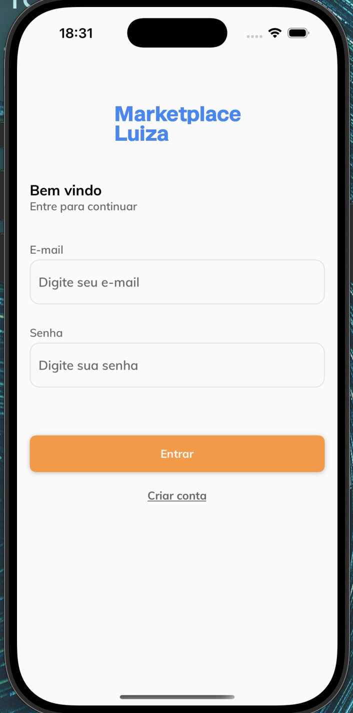
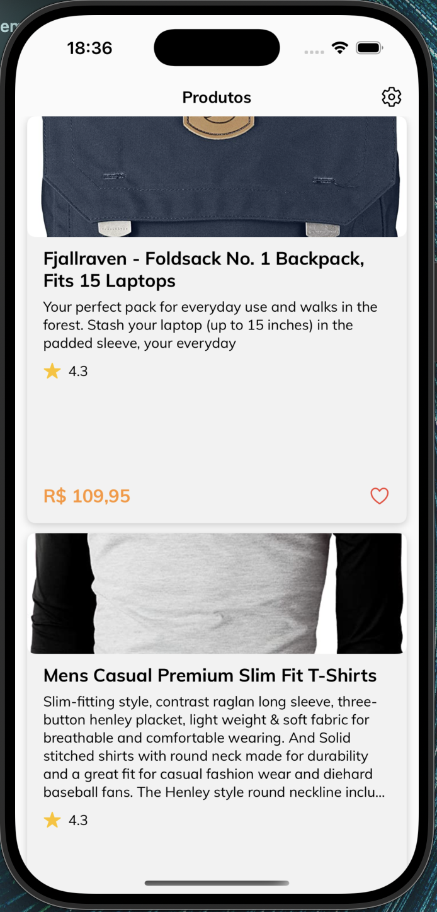
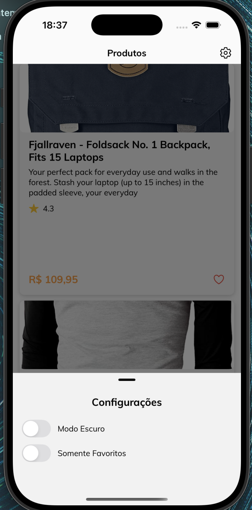

## About

App showcase.

## 🏗 Como rodar o projeto?

- execute yarn
- execute pod install
- execute yarn ios ou yarn android

## Firebase

- Este projeto possui integração com firebase authentication
- Para facilitar os testes e analise deixei o projeto pro pra executar, após o período da avaliação
as chaves serão excluídas
